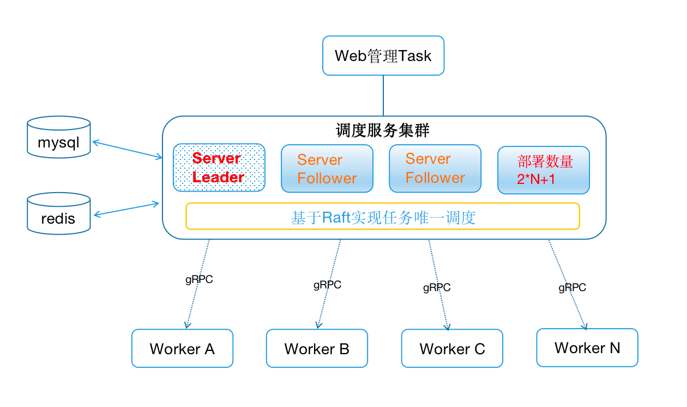
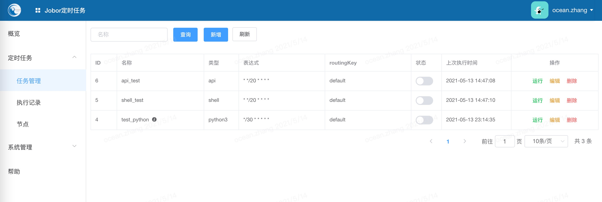
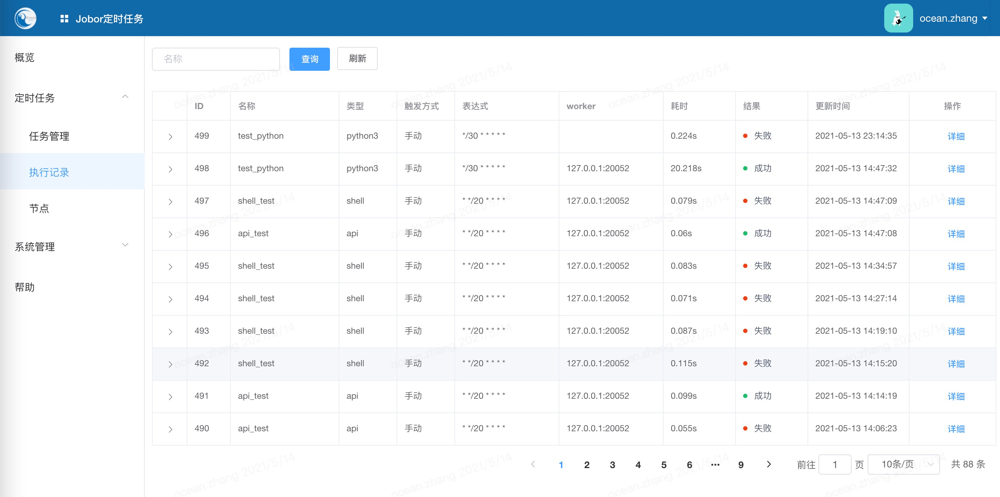
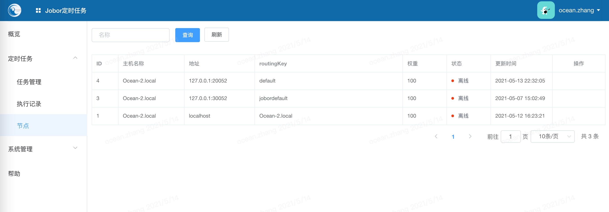
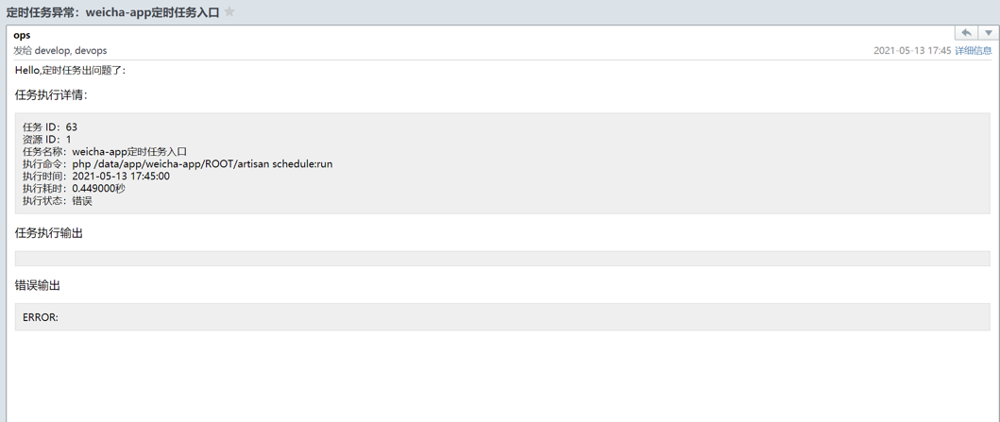

# Jobor分布式定时任务
## ✨ 功能特性
- 通过raft一致性算法，实现多server/controller/master的高可用，不同于传统的分布式只实现worker端的高可用，调度端只能是单点来避免同一任务同一时间被重复调度执行，从而达到了整个服务（Server,Worker）的高可用，保证了系统的健壮稳定性。
- worker高可用，并且通过路由标识，worker可以部署在不同环境，实现不同环境worker的权限控制，worker的系统环境依赖（Python,Golang,执行依赖的文件）。
- 调度server与worker通过grpc通信。
- 支持LDAP（openldap,AD）协议用户认证。
- 支持多种任务脚本 [ api/restful请求, shell, python3 ] e.g
- 基于Casbin实现的权限认证

## 架构图


## 构建
```
make Makefile build
make Makefile build-linux
make Makefile build-mac
or
go build
```

## 二进制部署
```
下载链接：https://github.com/v-mars/jobor/releases
tar -zxvf jobor-2.0.1.tar.gz
cd jobor-2.0.1
server:
./bin/jobor server -c configs/config.toml
worker:
./bin/jobor worker -c configs/worker.toml
```

## 命令
```
./app -h
Usage:
   [command]

Available Commands:
  worker      Start Run jobor worker
  help        Help about any command
  server      Start Run Jobor Server
  version     Print the version of Jobor

Flags:
  -h, --help   help for this command

Use " [command] --help" for more information about a command.

```

## 启动Server
```
 
./app server -h
Welcome User Jobor Server

Usage:
   server [flags]

Examples:
## 启动命令 ./app server -p 5000 -c ./configs/config.toml -f ./logs

Flags:
  -c, --config string   config file, example: ./configs/config.toml
  -h, --help            help for server
  -i, --ip string       服务IP (default "0.0.0.0")
  -l, --level string    日志级别(DEBUG, INFO, WARNING e.g)
  -f, --log string      日志目录(/data/logs e.g) (default "./logs")
  -m, --mode string     启动模式(release, debug, test e.g)
  -p, --port string     服务启动的端口: 5000 (default "5000")

./app server -p 5000 -c ./configs/config.toml -f ./logs
```

## Server端raft配置
```
# 一个Raft集群通常包含2*N+1个服务器，允许系统有N个故障服务器。
[Raft]
bootstrap = true    # 如果是第一台设置为true，否则为：false
httpAddress = "127.0.0.1:2869"
tcpAddress = "127.0.0.1:2889"   # 不能设置成: 0.0.0.0:2869, 必须是ip:port.
dataDir = "./raft_data"
joinAddress = ""    # 如果是第一台设置为空，否则设置第一台的httpAddress
```

## raft 相关管理API
```
curl "http://localhost:2869/set?key=ping&value=pong"
curl "http://localhost:2869/get?key=ping"
curl "http://localhost:2869/delete?key=ping"
curl "http://localhost:2869/join"
curl "http://localhost:2869/remove"
curl "http://localhost:2869/stats"
curl "http://localhost:2869/member"
[{"serverID":"127.0.0.1:2869","serverAddress":"127.0.0.1:2889","isLeader":true}]%  
```

## 启动Worker
```
./app worker -c ./configs/worker.toml
```

## 默认
username: admin
password: admin

## DB
```
字符集：utf8mb4
在配置文件最后一行粘贴以下语句
/etc/mysql/conf.d/mysql.cnf

[mysqld]
sql_mode=STRICT_TRANS_TABLES,NO_ZERO_IN_DATE,NO_ZERO_DATE,ERROR_FOR_DIVISION_BY_ZERO,NO_AUTO_CREATE_USER,NO_ENGINE_SUBSTITUTION

```


## Jobor预览






## TODO 
### task
- [x] 支持server/controller/master(通过raft一致性算法)的高可用，一个Raft集群通常包含2*N+1个服务器，允许系统有N个故障服务器。
- [x] ldap(支持openldap,AD 认证)
- [x] server <-- gRPC --> worker
- [x] task abort
- [x] task timeout
- [x] api/restful [GET, POST, PUT, DELETE] task
- [x] shell task
- [x] python3 task
- [ ] golang task
- [x] server task
- [ ] father task
- [ ] children task
- [ ] 任务缓存执行

## 🤝 特别感谢
- golang 1.16.4
- gin
- gin-swagger
- jwt
- gorm
- raft
- casbin
- mysql 5.7
- redis 5
- 等

## 支持
1、希望大家多多支持，给项目一个star

2、该项目花费了作者大量时间，如果你觉的该项目对你有用，希望可以友情赞助一下


## 交流/商务联系
```
如果您只是使用本项目的话，您可以在提出您使用中需要改进的地方，我会尽快修改。
如果您是想基于此项目二次开发的话，您可以提出您在开发过程中的任何疑问，我会尽快答复并讲解。
```


