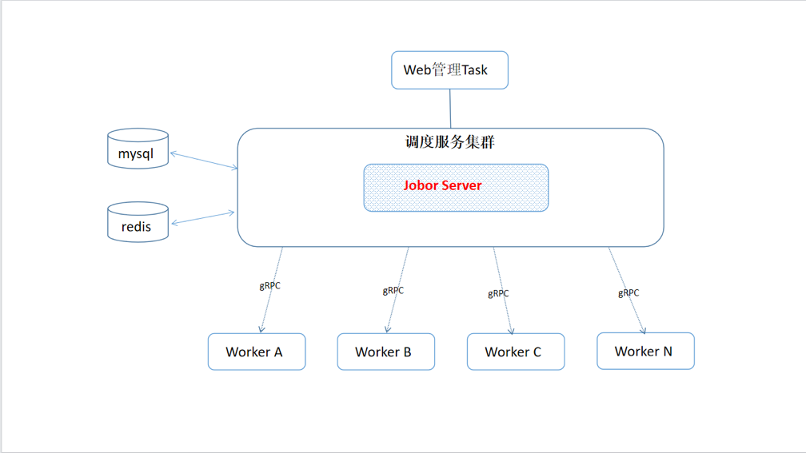

# Jobor分布式定时任务
## ✨ 功能特性v3.0.1
- 为简化使用和理解成本，之前v2版本的Master Raft模式已经移除，目前Master节点只支持单节点，如有需要请联系作者购买企业版
- worker高可用，并且通过路由标识，worker可以部署在不同环境，实现不同环境worker的权限控制，worker的系统环境依赖（Python,Golang,执行依赖的文件）。
- 调度server与worker通过grpc通信。
- 支持LDAP（openldap,AD）协议用户认证。
- 支持多种任务脚本 [ api/restful请求, shell, python3 ] e.g
- 基于Casbin实现的权限认证
## 提示
```text
Jobor V3已经修复已知所有Bug，并且新增功能：父子任务执行、执行节点组、任务归属负责人、支持国产http,rpc框架（字节跳动）、支持golang任务类型执行。
```

## 架构图


## 部署(推荐使用docker模式运行)
```text
docker pull iocean/jobor:server-v3.0.0
docker pull iocean/jobor:worker-v3.0.0
docker pull iocean/jobor:worker-go-v3.0.0
docker pull iocean/jobor:worker-py-v3.0.0
docker run -itd --name jobor-server --restart=always -v /etc/localtime:/etc/localtime -v ${HOST_DIR}/conf:/data/conf -v ${HOST_DIR}/log:/data/log --net=host iocean/jobor:server-v3.0.0
docker run -itd --name jobor-worker --restart=always -v /etc/localtime:/etc/localtime -v ${HOST_DIR}/conf:/data/conf -v ${HOST_DIR}/log:/data/log --net=host iocean/jobor:worker-v3.0.0
docker run -itd --name jobor-worker-py --restart=always -v /etc/localtime:/etc/localtime -v ${HOST_DIR}/conf:/data/conf -v ${HOST_DIR}/log:/data/log --net=host iocean/jobor:worker-py-v3.0.0
docker run -itd --name jobor-worker-go --restart=always -v /etc/localtime:/etc/localtime -v ${HOST_DIR}/conf:/data/conf -v ${HOST_DIR}/log:/data/log --net=host iocean/jobor:worker-go-v3.0.0
```

## 构建
```
go build -o ./app ./main.go
go build -o ./app ./cmd/worker/main.go
```

## 启动Server(推荐使用docker模式运行)
```
go build -o ./app ./main.go

./app -c ./conf/config.yaml
```


## 启动Worker(推荐使用docker模式运行)
```
go build -o ./app ./cmd/worker/main.go
./app -c ./conf/worker.yaml
```

## 默认
username: admin
password: admin

## DB
```
数据库推进使用：MySQL8.0
字符集：utf8mb4
在配置文件最后一行粘贴以下语句
/etc/mysql/conf.d/mysql.cnf

[mysqld]
sql_mode=STRICT_TRANS_TABLES,NO_ZERO_IN_DATE,NO_ZERO_DATE,ERROR_FOR_DIVISION_BY_ZERO,NO_AUTO_CREATE_USER,NO_ENGINE_SUBSTITUTION

```


## Jobor预览


## TODO 
### task
- [x] 支持server/controller/master(通过raft一致性算法)的高可用，一个Raft集群通常包含2*N+1个服务器，允许系统有N个故障服务器（企业版）。
- [x] ldap(支持openldap,AD 认证)
- [x] server <-- gRPC --> worker
- [x] task abort
- [x] task timeout
- [x] api/restful [GET, POST, PUT, DELETE] task
- [x] shell task
- [x] python3 task
- [x] golang task
- [x] server task
- [x] father task
- [x] children task
- [x] worker 预执行（如：执行python 前先执行 pip install xx）
- [x] worker 节点支持：agent和ssh两种模式
- [x] 路由标识多选
- [ ] 任务缓存执行

## 🤝 特别感谢
- golang 1.20
- hertz （字节http框架）
- hertz-swagger
- kitex （字节rpc框架）
- gorm
- casbin
- mysql 8.0
- redis 5
- 等

## 支持
1、希望大家多多支持，给项目一个star

2、该项目花费了作者大量时间，如果你觉的该项目对你有用，希望可以友情赞助一下


## 开源、企业版区别
| 功能         | 开源 | 企业 |
|------------| - | - |
| 前端源码       | 静态产物 | 支持 |
| Master高可用  | - | 支持 |
| Worker高可用  | 支持 | 支持 |
| LDAP认证     | 支持 | 支持 |
| Shell任务    | 支持 | 支持 |
| API/HTTP任务 | 支持 | 支持 |
| Python任务   | 支持 | 支持 |
| Golang任务   | 支持 | 支持 |
| 父子任务       | 支持 | 支持 |
| 定制功能       | Issues | 立刻 |
| 服务支持       | Issues | 微信群 |


## 交流/商务联系
```
如果您只是使用本项目的话，您可以在提出您使用中需要改进的地方，我会尽快修改。
如果您是想基于此项目二次开发的话，您可以提出您在开发过程中的任何疑问，我会尽快答复并讲解。
```


## 关联
* 还可提供SSO（OIDC）统一认证服务
* 运维CMDB系统服务
* 持续集成发布系统，支持k8s、docker、虚拟机、静态资源发布，支持当下流程的染发发布、灰度发布、迭代流水线发布


